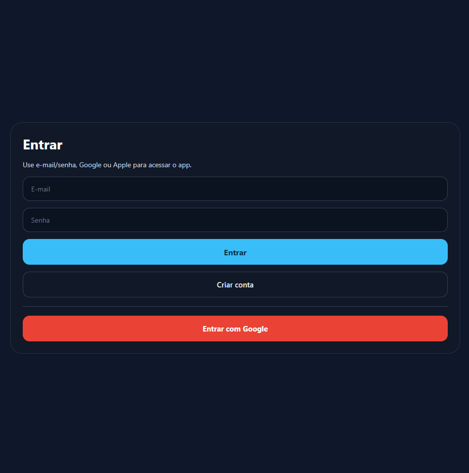
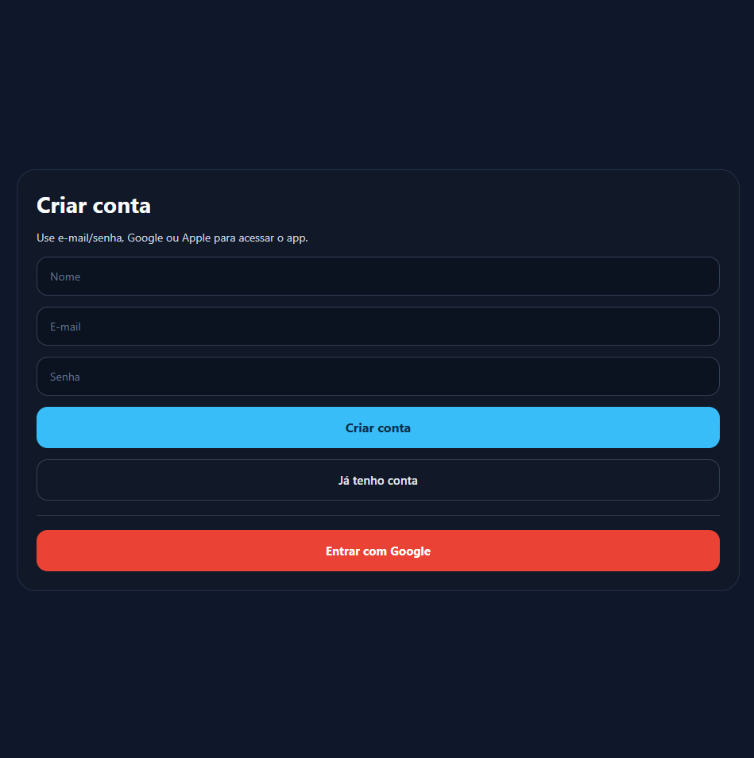
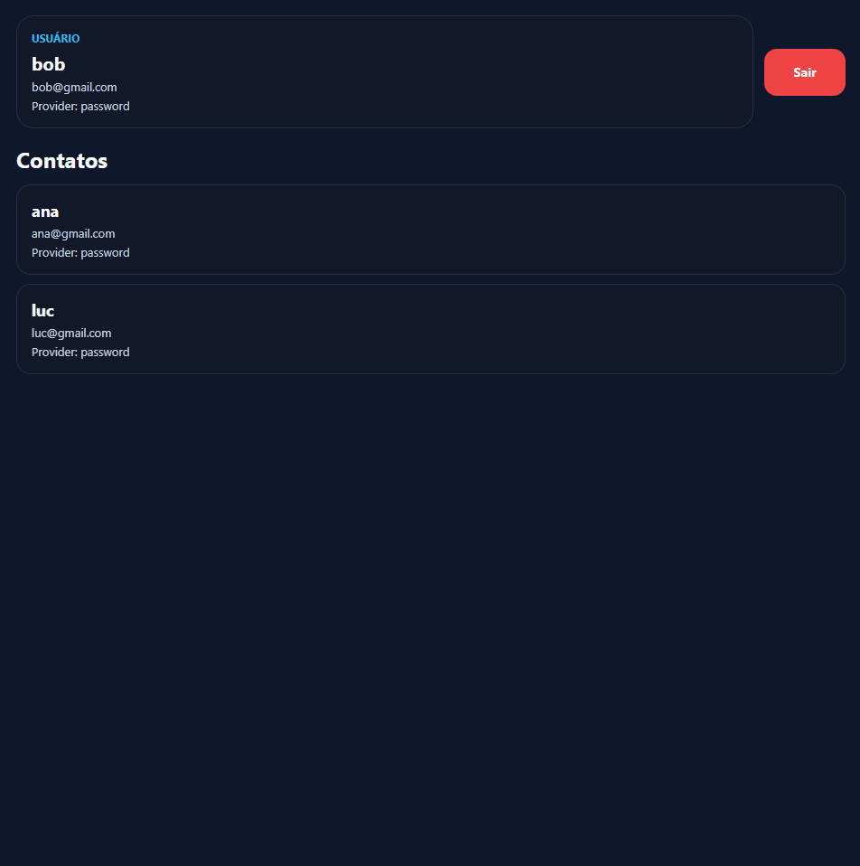
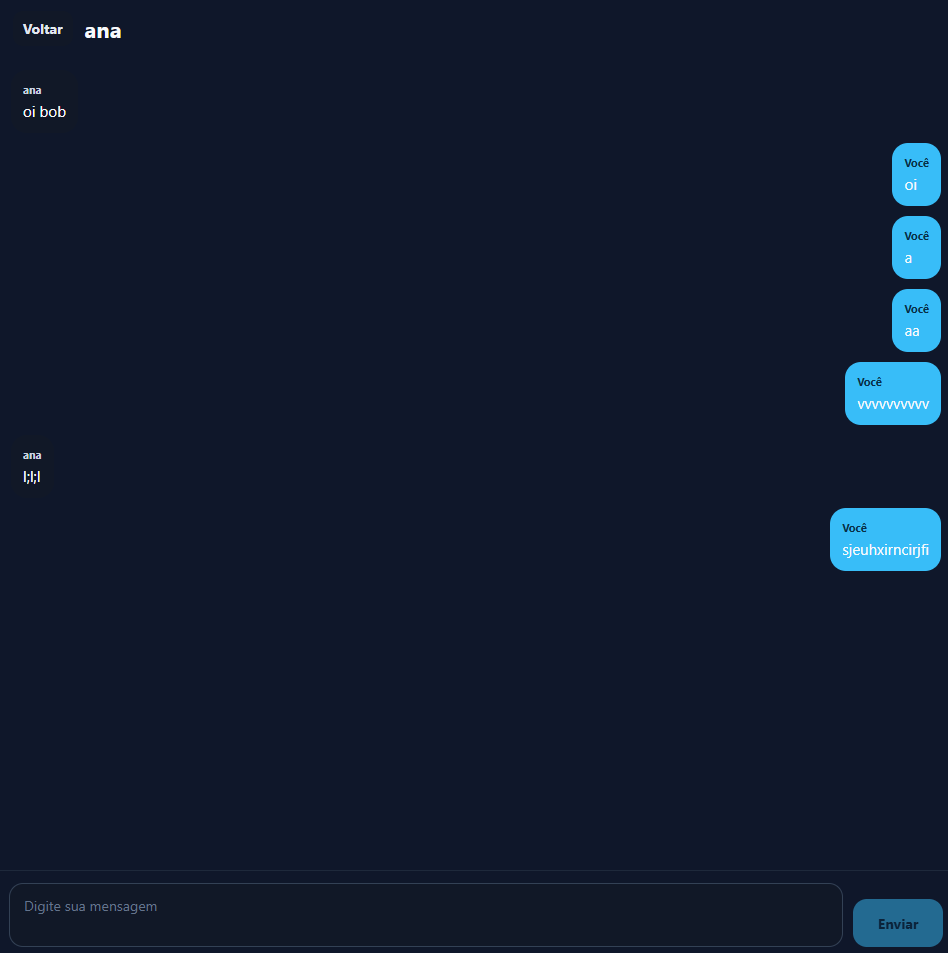

# chat SEIA

Aplicativo de chat em tempo real desenvolvido com React Native + Expo + Firebase.

## Descrição

Este projeto é uma aplicação de chat 1 para 1 com autenticação de usuários e sincronização em tempo real utilizando o Firebase. 

O app permite cadastro e login com e-mail e senha.

## Tecnologias utilizadas

- React Native
- Expo
- TypeScript
- Firebase Authentication
- Firebase Realtime Database
- Expo Apple Authentication
- Expo Auth Session
- Expo Web Browser
- React Native Safe Area Context

## Versão do Expo

- Expo: ~54
- React Native: 0.81.5

## Serviços Firebase utilizados

- Firebase Authentication
- Firebase Realtime Database

## Pré-requisitos

Antes de rodar o projeto, verifique se você possui instalado:

- Node.js
- npm ou yarn
- Expo CLI
- Android Studio / emulador Android ou app Expo Go no celular

## Instruções para execução

1. Clone o repositório
2. Acesse a pasta do projeto
3. Instale as dependências:

```bash
npm install
```

4. Inicie o projeto:

```bash
npx expo start
```

5. Escolha uma opção:

- escanear o QR code com o app Expo Go no Android/iPhone
- rodar na web

## Configuração básica do Firebase

1. Acesse o Firebase Console
2. Crie um projeto Firebase
3. Ative o Firebase Authentication
4. Ative o Realtime Database
5. Configure o app no Firebase e copie as chaves de configuração
6. Atualize o arquivo `src/services/firebase.ts` com as informações do seu projeto

Exemplo de estrutura esperada:

```ts
export const firebaseConfig = {
  apiKey: 'SUA_API_KEY',
  authDomain: 'SEU_PROJETO.firebaseapp.com',
  databaseURL: 'https://SEU_PROJETO-default-rtdb.firebaseio.com/',
  projectId: 'SEU_PROJETO',
  storageBucket: 'SEU_PROJETO.appspot.com',
  messagingSenderId: 'SEU_SENDER_ID',
  appId: 'SEU_APP_ID',
};
```

### Autenticação

- Habilite autenticação por e-mail/senha

### Realtime Database

- Crie a base no modo Realtime Database
- Defina regras de segurança antes de publicar a aplicação

## Estrutura do projeto

```text
.
├── app.json
├── App.tsx
├── index.ts
├── package.json
├── README.md
├── assets/
├── src/
│   ├── components/
│   │   ├── ChatInput.tsx
│   │   ├── ChatMessage.tsx
│   │   ├── ErrorMessage.tsx
│   │   ├── Loading.tsx
│   │   └── UserItem.tsx
│   ├── contexts/
│   │   └── AuthContext.tsx
│   ├── hooks/
│   │   ├── useAuth.ts
│   │   └── useChat.ts
│   ├── screens/
│   │   ├── ChatScreen.tsx
│   │   ├── LoginScreen.tsx
│   │   ├── MenuScreen.tsx
│   │   └── UsersScreen.tsx
│   ├── services/
│   │   ├── authService.ts
│   │   ├── chatService.ts
│   │   ├── firebase.ts
│   │   └── userService.ts
│   ├── types/
│   │   ├── chat.ts
│   │   └── user.ts
│   └── utils/
│       └── chatRules.ts
└── tsconfig.json
```

## Prints da aplicação






## Observações

Este projeto implementa autenticação por e-mail e senha. O login com Google e Apple não foi incluído porque essas formas de autenticação não foram ensinadas durante o desenvolvimento do projeto.

## integrantes

Joao Victor Oliveira dos Santos - RM557948
Matheus Alcântara Estevão - RM558193
Nicolle Pellegrino Jelinski - RM558610
Pedro Pereira dos Santos - RM552047
Eric Segawa Montagner - RM558224
